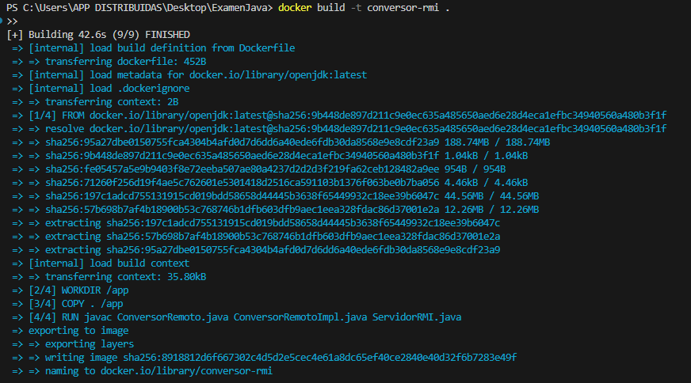
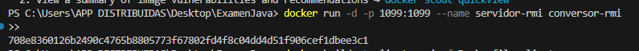
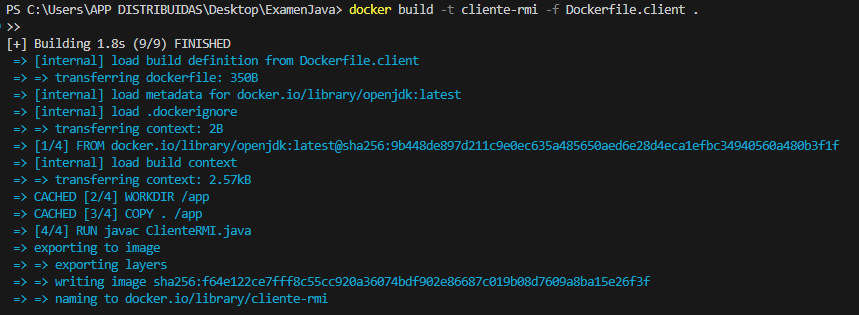
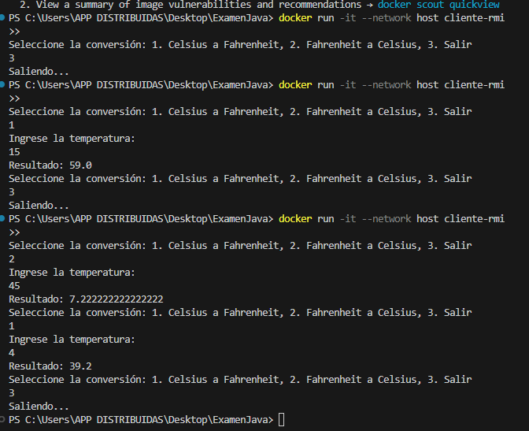
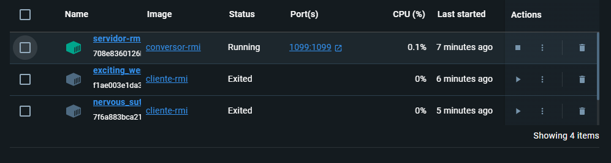

# Docker en ejecución
## Servidor
1. Construcción de la imagen  

2. Ejecutar la imagen  

## Cliente
1. Construir la imagen 

2. Ejecutar la imagen  

3. Revisar en Docker que se haya creado los contenedores  
